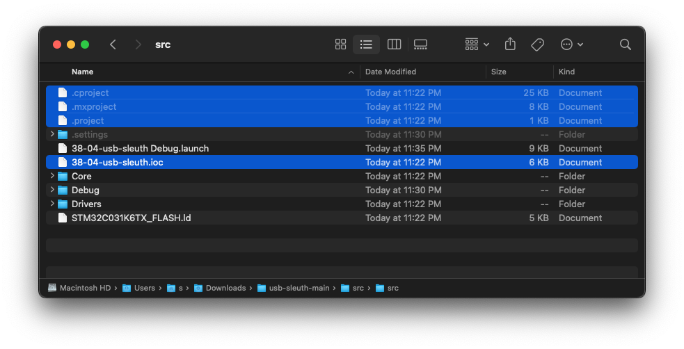
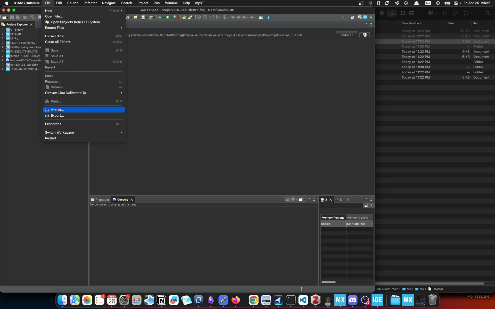
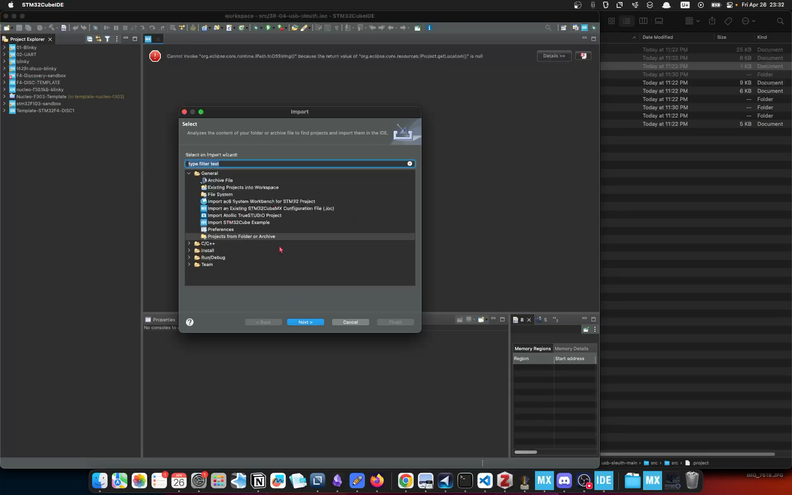
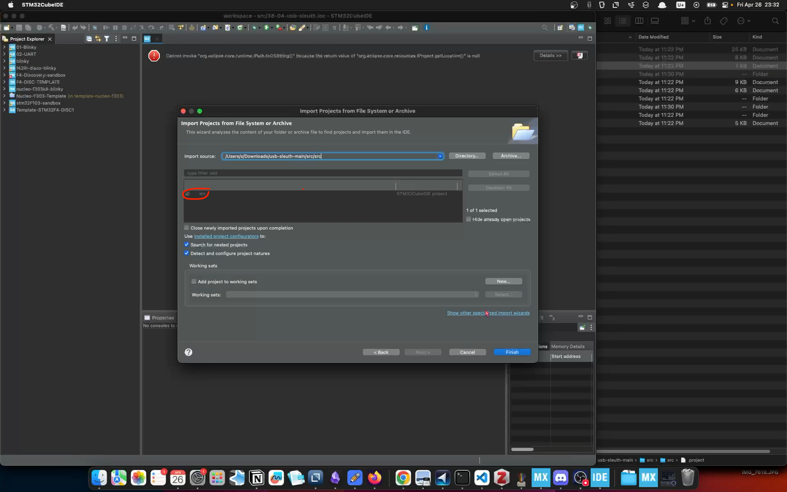
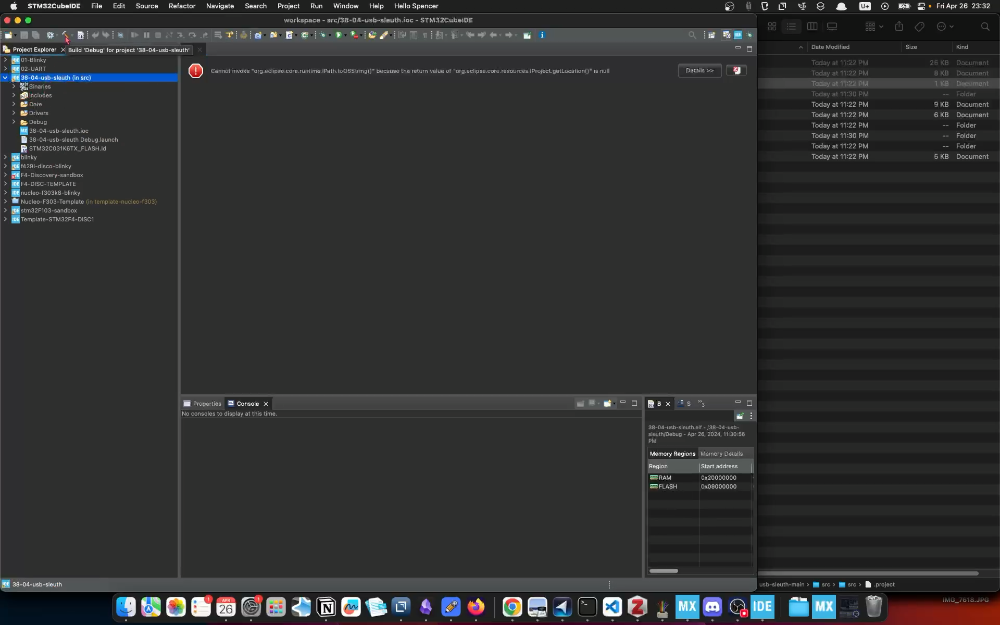
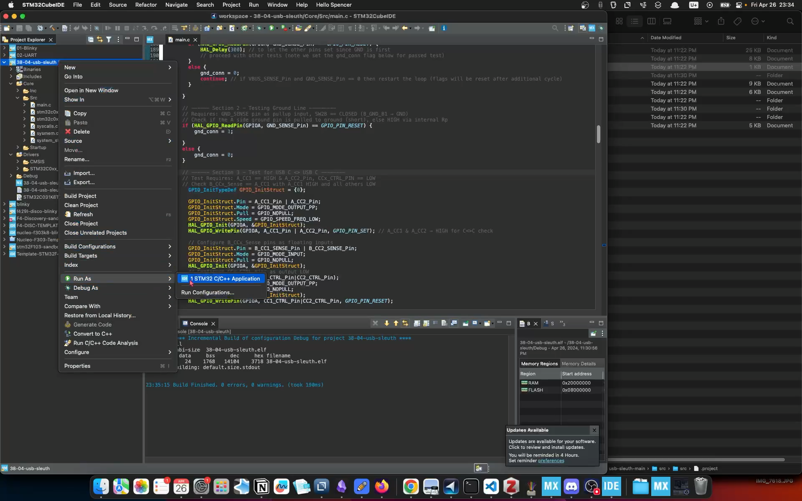
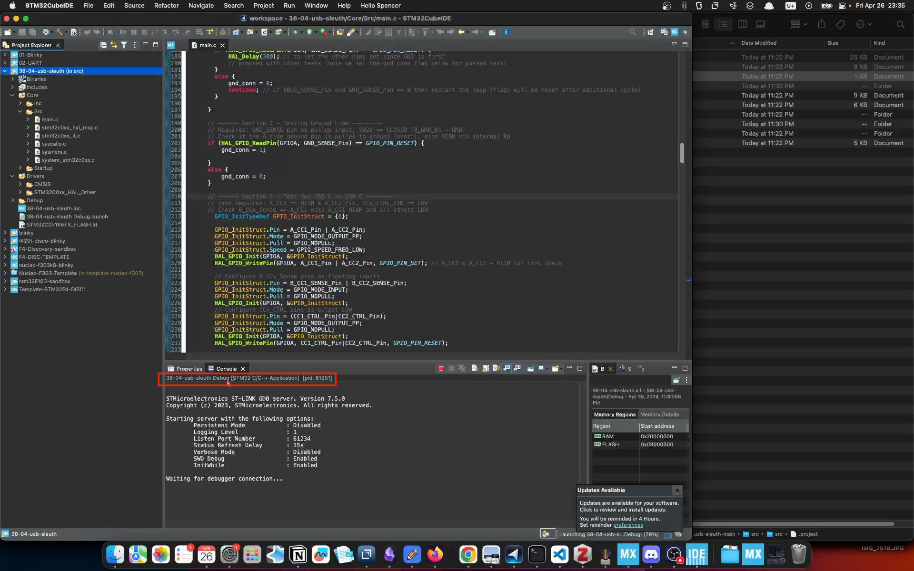
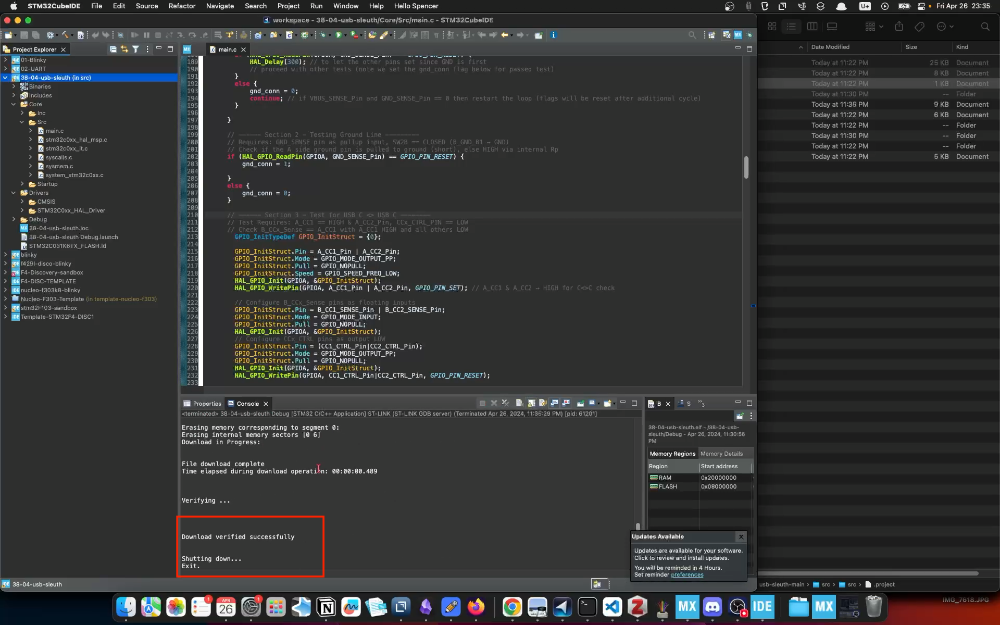

First, make sure the project has these files otherwise STM32CubeIDE won't have the correct build and debug settings (you won't even be able to build):
- .cproject
- .mxproject
- .project
- .ioc file

Then import the project as  `File > Import > Projects from Folder or Archive`

Select the project root and make sure the following dialogue has the checkbox checked in the form field for the project and click `Finish` to import the project

> [!NOTE] If this checkbox is not checked it won't import the project. It could be that the CubeIDE thinks you already have imported the project into your workspace, so you need to delete the project from your workspace (or open a new workspace), and refresh/clean the workspace, then you should be able to import again.

You should now see the project in the sidebar as e.g. `38-04-usb-sleuth (in src)`

Click on the project and then see if you can build it:

Note: Build issues could be missing driver dependencies or other source/header files missing, or a bad configuration of the Includes paths. HAL drivers should be in `src/Drivers`.

To flash the firmware right click on the project and go to `Run As > STM32 C/C++ Application`

Make sure the console shows the correct project is being build and run. It is easy to accidentally select the wrong project. 

Verify download is complete - you should now have a flashed device!

