## Overview

The device tests for continuity within USB cables for USB 2.0, 3.0, and 3.1 pinouts. A STM32C031K6T microcontroller is used for testing connection and orientation of certain pins, and others are simple continuity tests.

This USB cable tester has the "B" side on the right, and the "A" side on the left.

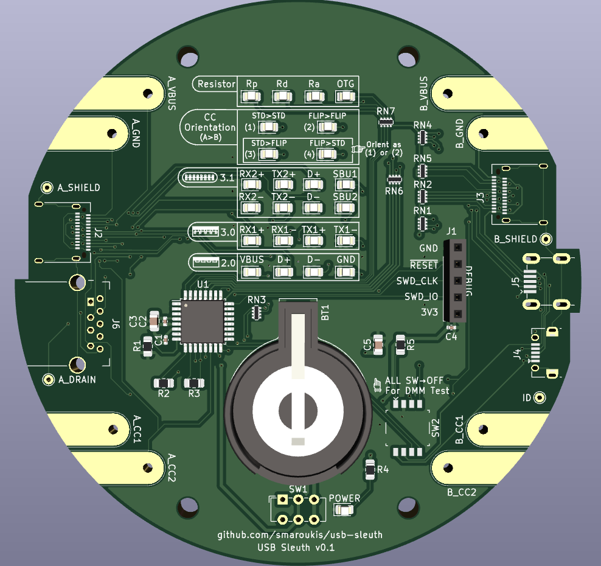

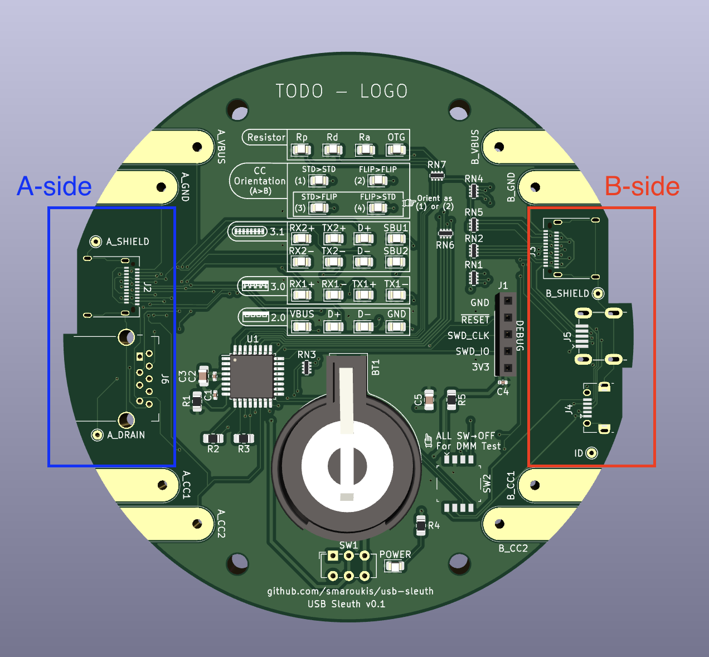

The device has some benefits over a simple continuity tester
- detecting orientation of the USB-C cable
- detecting pullup and pulldown resistors on the CC and VCONN lines
- USB-compliant: This device doesn't apply a +V to the Ground line/pin, instead it uses a MCU to test the presence of a connected ground wire
- various pins are exposed to test cable and/or pullup/pulldown resistances directly with a DMM

> [!CAUTION] 
> Note for correct continuity testing of the USB3.1 pins, the cable should be in the CC orientation of either `STD>STD` or `FLIP>FLIP`. See on-board LEDs for configuration.

Layout
- Various B side pins are biased to VBUS through pullup resistors. A side pins are either connected to ground through an LED, thus lighting up if the corresponding wire is continuous, or the pins are connected into the MCU for inputs. These pins are shown below. 

Pins that the MCU tests for
- Ground (note all four GND pins are tied together)
- Vbus (note all four VBUS pins are tied together)
- CC1 to test for CC line
- CC2 to test for VCONN line and pull down resistor for active cables, as well as a flipped CC cable

> Note: Both A-side and B-side CC1 and CC2 pins are tapped off into corresponding control inputs to the MCU through a resistor, allowing for pulling the control pins high or low to sense the result on the opposite side.

## Programming and Reset

Programming is done via the Serial Wire Debug headers (labeled `DEBUG`) via an STLink debugger probe. 

The device can also be reset by shorting out the `nRESET` line to `GND` (pins 1 and 2 on the header).

> [!CAUTION]
> In the case where the debugger is providing power to the target, make sure the `POWER` switch is `OFF`.

> [!NOTE]
> For the `SWD` pins we need pullup or pulldown resistors on `SWDIO` and `SDCLK` respectively. These are provided internally by the STM32 MCU, but if there is an issue with the debugger try adding an external weak pulllup and pulldown (10K-100K).

## Testing VBUS and GND 

All VBUS pins are tied together and tested via a pulldown resistor on the MCU. 

B side feeds A side
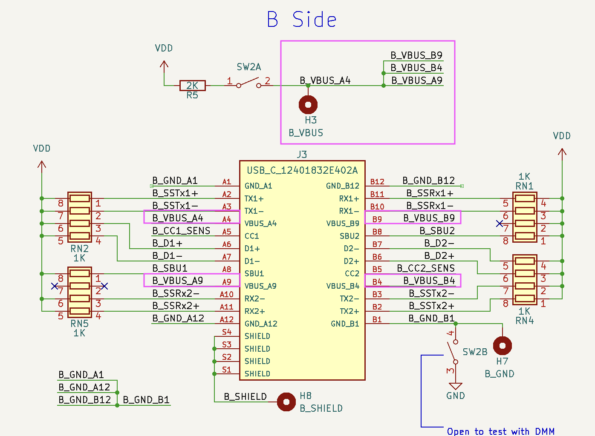

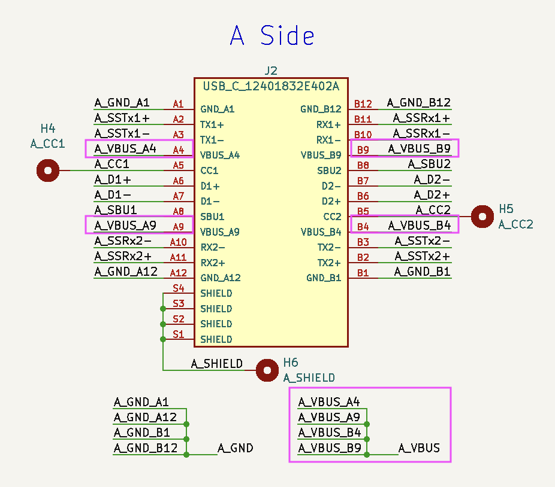

This passes through a isolation switch

> [!NOTE] 
> The testing pad is on the receptacle side to isolate us from the MCU for DMM testing.

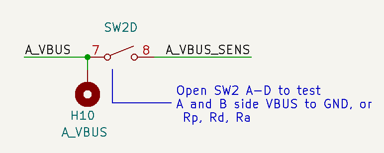

`VBUS_SENS` pin is an input to the MCU with a pull down resistor forming a voltage divider with the 2K VDD pulllup resistor. If the `VBUS` line is discontinuous, the pin reads `LOW`. If `VBUS` is continuous then the pin reads `VCC`x10/12, or digital `HIGH`. 

Output LEDs are driven by the MCU outputs `GND_LED` and `VBUS_LED`

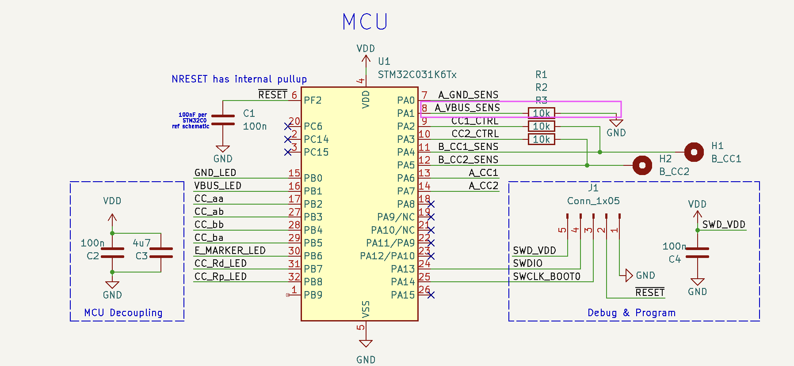

> [!NOTE]
> This is why the "stronger" 2K pullup is needed, to only drop a voltage of VCCx2/(2+10), which is negligible in the digital logic sense→ [Pullup Resistors](Pullup%20Resistors.md)

## Testing CC Orientation for USB-C

USB 2.0 Type-C Plug Pin-Out
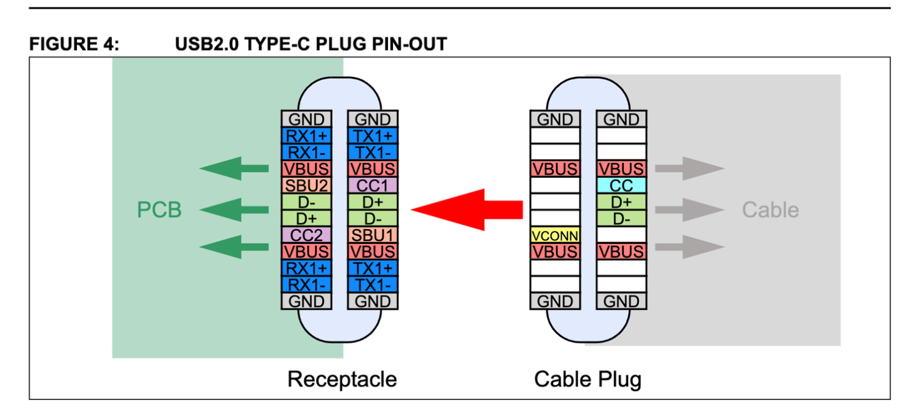
> Source: https://ww1.microchip.com/downloads/en/appnotes/00001953a.pdf

Possible orientations of USB-C Plug.

Simplified PCB layout:

Testing Procedure
1. Apply test voltage to `A_CC1`:
	1. `CC1_CTRL` → `LOW` and `A_CC1` → `HIGH` and `A_CC2` → `LOW`
	2. `CC2_CTRL` → `LOW` (and `B_CC1` → `LOW` or Open)
	3. If `B_CC1` or `B_CC2` is `HIGH`, then this is the pin that `A_CC1` is connected to. 
	4. If neither are `HIGH` we are connected to `VCONN`, so apply test voltage to `A_CC2`
2. Apply test voltage to `A_CC2`:
	1. (same as above but pins swapped)

## DMM Testing of  Rp on CC line

> [!Caution]
> Verify the following:
> 1. USB cable is in the normal CC Orientation of `STD>STD` before proceeding.
> 2. All DIP switches are in the OFF position
> 3. Power switch is in the OFF position

For the Type-A to C cable the USB standard specifies at 56K pullup resistor between `VBUS` and `CC` (since the A side is the host, CC pin needs to be pulled up for the B-side/peripheral to recognize A side as host). 

We can test the exact value of this resistor by using a DMM between `B_VBUS` and `B_CC1` testing pads.

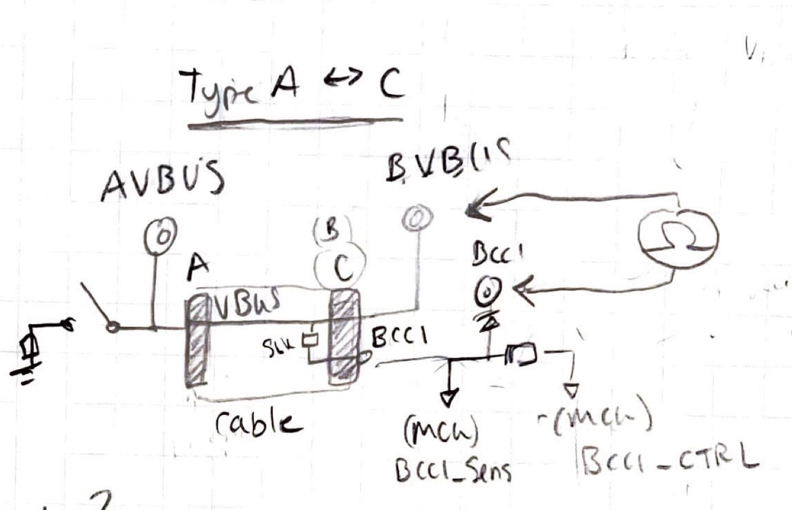

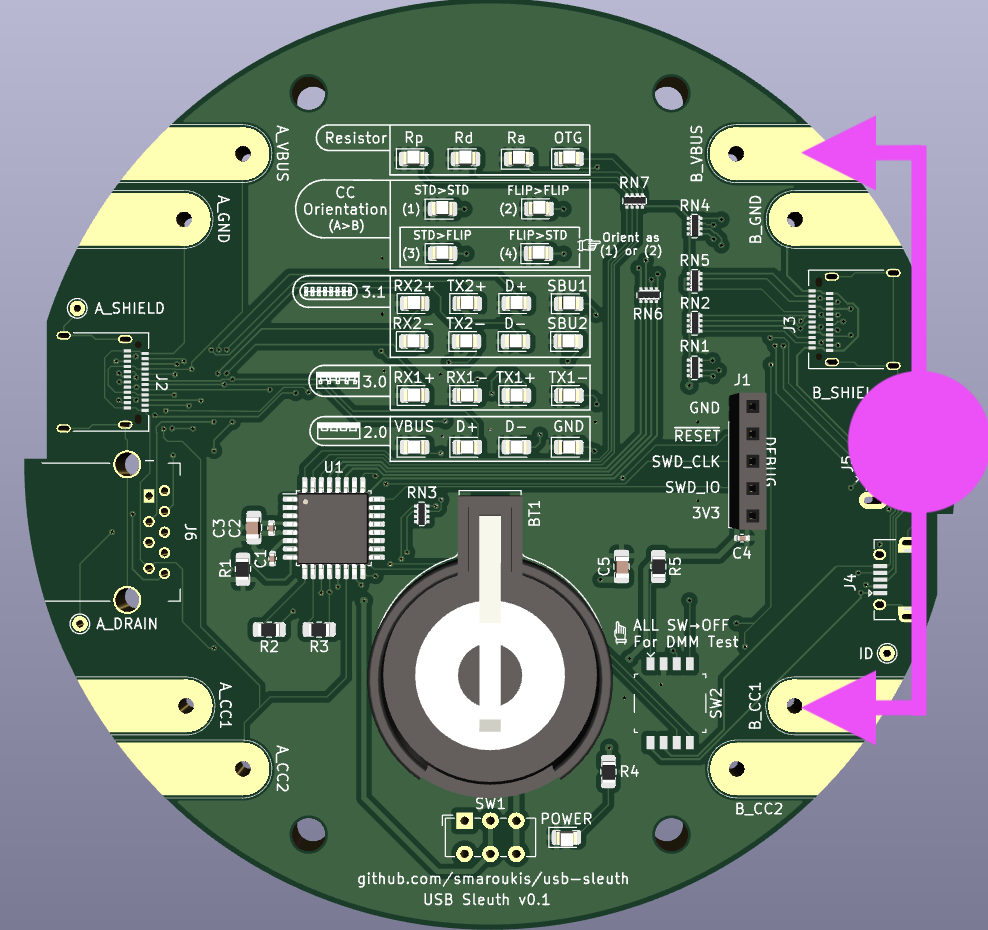

## DMM Testing of Rd

> [!Caution]
> Verify the following:
> 1. USB cable is in the normal CC Orientation of `STD>STD` before proceeding.
> 2. All DIP switches are in the OFF position
> 3. Power switch is in the OFF position

For the Type-B to C cable the USB standard specifies at 5K6 pulldown resistor between `CC` and `GND` (since the B side is the peripheral, CC pin needs to be pulled down for the A-side/host to recognize B side as peripheral). 

We can test the exact value of this resistor by using a DMM between 
`A_GND` and `A_CC1` 

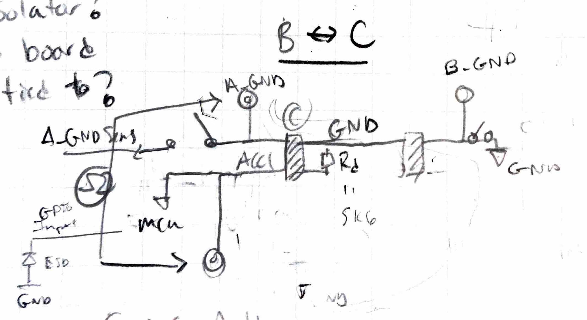

> [!NOTE]
> Note we don't need an isolation switch from the MCU on the `A_CC1` side since we have isolated both `B_GND` and `A_GND` sides

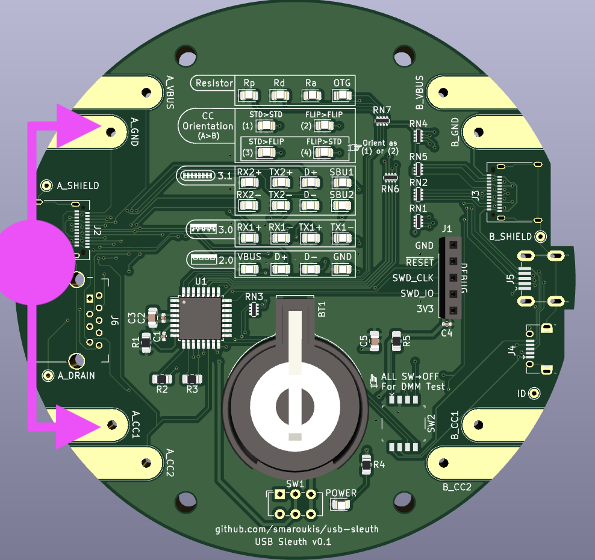

## DMM Testing of Ra

1. With device ON, make sure the CC orientation is `STD>STD`
2. Switch isolation switches to OFF
3. Switch power OFF
4. Place a DMM between `B_CC2` and `B_GND`

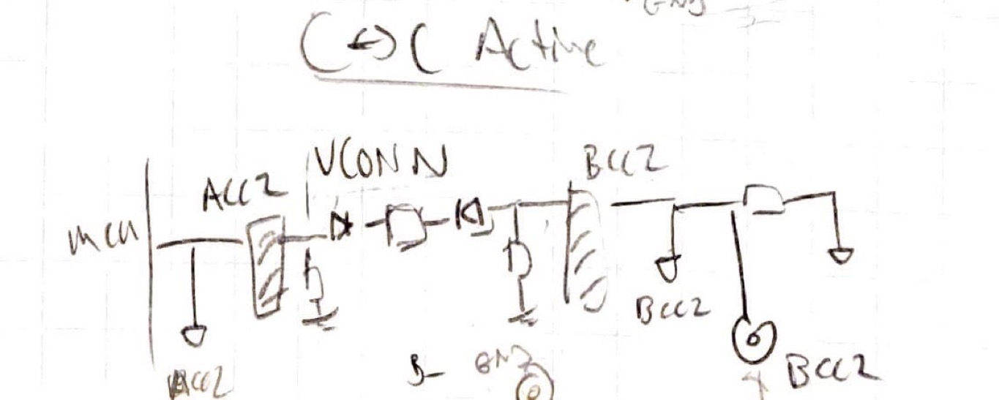

## MCU Testing of Rp on Type-A to Type-C Cable

Setup
- `VBUS` is connected to `VCC` through a 2K resistor (ignored for the calculations below)

MCU Procedure
1. Write `CC1_CTRL` and `CC2_CTRL` → `LOW` (pulls `B_CC1` pin `LOW` through 10K R)
2. Perform analog read of `B_CC1_Sens` and `B_CC2_Sens`
3. If the analog read is above ground (and any noise), then the pullup exists. (Otherwise the pin is pulled down with no current path, so straight to 0V)

> [!tip] An analog read is required since the value of Rp is large enough such that it doesn't pull it all the way up to the digital `HIGH` threshold

> [!NOTE]- Aside - The effect of the 10K pulldown on VBUS
> - With both the strapping (pulldown) resistor on VBUS and the 2K input resistor, the effect is the voltage at the sense pin is reduced by 20%, or from 0.5V to 0.41
> - 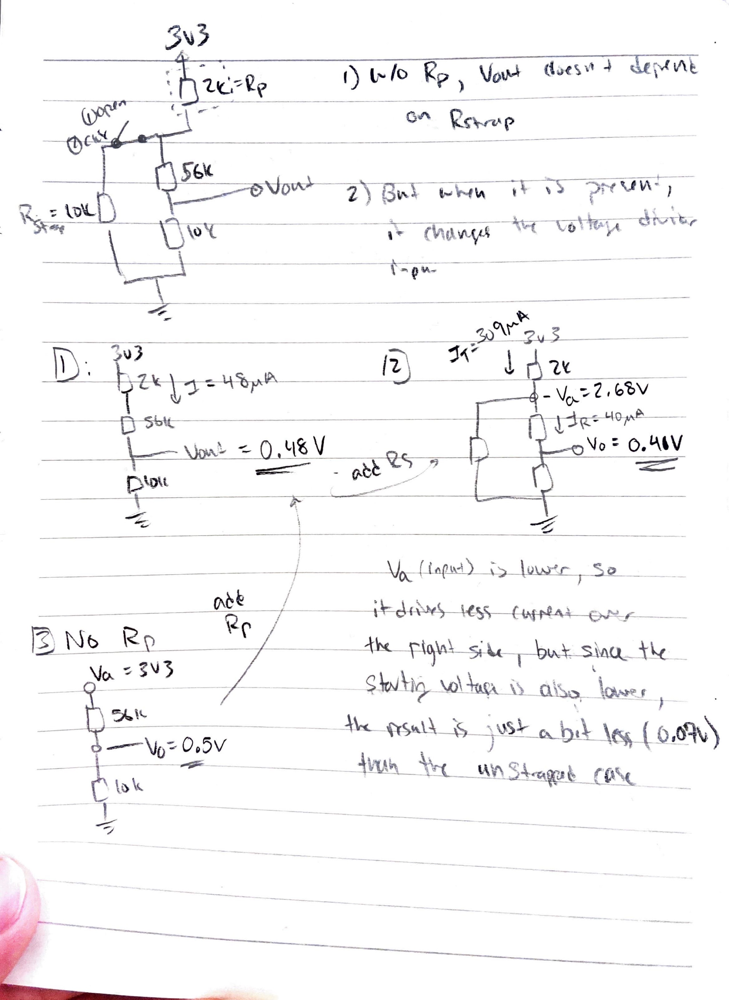

## MCU Testing of Rd on Type-B to Type-C Cable

> This works for both CC configurations

1. Set `A_CC1` and `A_CC2` as `INPUT_PULLUP` (~50K internal pullup)
2. Read `A_CC1` and `A_CC2`, if either are pulled `LOW`, then it means that `Rp` is present (Rp = 5K6 which is much stronger than the 50K internal pullup)

## MCU Testing of Ra on Emarker (Active) Cables

The pulldown (Ra, for "active") is nominally 800-1.2K. Connection is as follows:

We simply configure the `A_CC2` and `B_CC2` pins as `INPUT_PULLUP`s and test if these lines (the `VCONN` line) are pulled low (normally it is open).

## Power Isolation For Testing

Isolation switches are provided to isolate the DMM from the MCU as it injects a test current to measure resistance, and also to allow us to measure the resistance of the cable itself (e.g. VBUS to GND). 

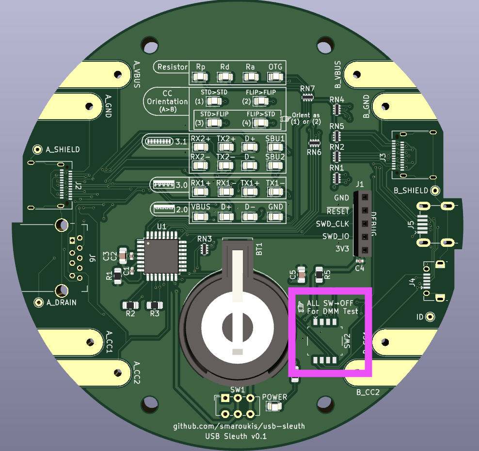

In the schematic these are modeled as a multi-unit DIP switch:
- `SW2A`: Separates `VCC` from `VBUS`
- `SW2B`: Separates `B_GND` from `GND`
- `SW2C`: Separates `A_GND` from `A_GND_SENS` (input to MCU)
- `SW2D`: Separates `A_VBUS` from `A_VBUS_SENS` (input to MCU)

## Shields and ID Pin

### Shields 
Shields are connected together and exposed to a through hole testing terminal. For this we can test with a multimeter. 

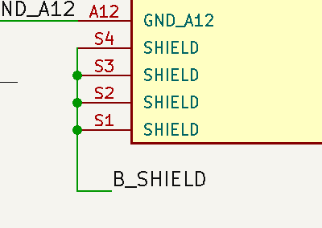

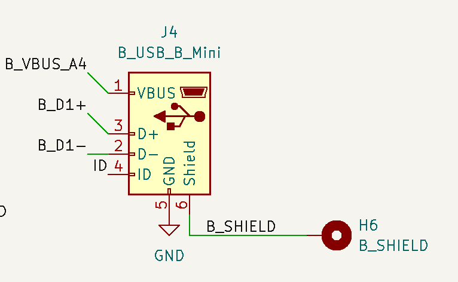

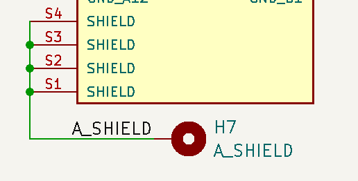

### ID (On The Go / OTG)

The OTG specification allows a USB device normally acting as a peripheral, to now act as a host (example use case: a tablet normally a peripheral, acting as a host can read from removable media on a flash drive)

For the OTG cable the A-plug side ties its ID pin to ground, and the B-plug side leaves it floating.  
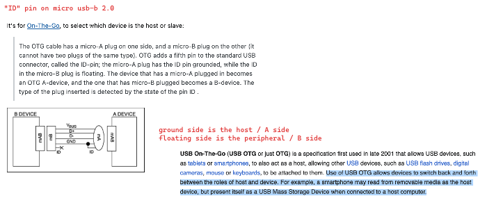

Since the ID pin is supposed to be tied to its ground pin within the plug, we just connect an LED between VDD → ID pin (=Ground pin) to test the connection.

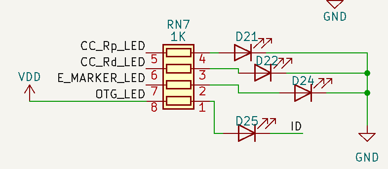

> The ID pin is also brought out on an exposed pad.

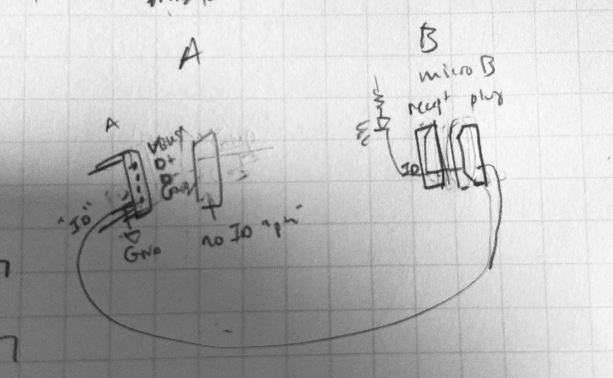

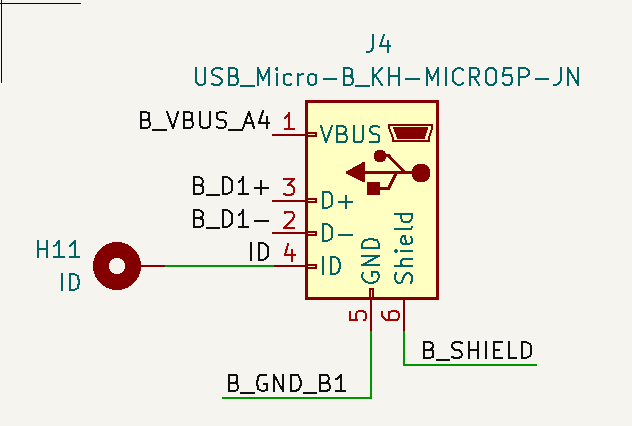

### Attributions
- tip icon https://thenounproject.com/icon/tip-6063021/

Inspirations
- https://github.com/petl/USB-C-cable-tester-C2C-caberQU
- https://github.com/alvarop/usb_c_cable_tester
- https://github.com/aroerina/LimePulse_USB_cable_checker/tree/master - mostly ripped off the design from this one, heh -- although I will open source my firmware.