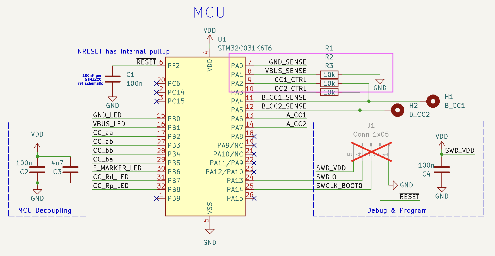

## Overview

The device tests for continuity and internal resistors within various USB Cables and exposes some pins for multimeter testing. 

A STM32C031K6T microcontroller is used for testing connection and orientation, powered by a CR2032 battery. Code is given using STM32 HAL libraries and the device can being programmed over SWD. 

KiCad and gerber files are provided for the board layout, as well as the library footprints for non-standard parts ordered from JLCPCB/LCSC. 
See the [BOM](/production/38-04-usb-tester_2023-12-18_rev1/bom.csv).

This USB cable tester has the "B" side on the right, and the "A" side on the left. Receptacles are given for the following:
- Type-C (both sides) 
- Type-C to A 
- Type-C to micro B (2.0)
- Type-C to mini B 

The device has some benefits over a simple continuity tester
- displays the as-plugged orientation of the 4 different possibilities of the USB-C to C cable
- detects pullup and pulldown resistors on the CC lines as required by the USB standard for legacy cables 
- identifies active cable with E marker (via the pulldown resistor present on VCONN)
- doesn't apply a +V to the Ground line/pin, instead it uses a MCU to test the presence of a connected ground wire
- exposes various pins to test cable and internal resistors manually with a DMM

## Example Tests

#### USB C-C Active Cable

> Note in this test only one of the USB 2.0 Data pair LEDs will light up depending on the cable orientation, showing that the two pairs are not connected inside the cable (the pairs are also not connected on the PCB). The user must flip the orientation to test both data pairs. 
#### DMM Test of Internal Resistor

Testing the value of the pulldown resistor on an active cable by measuring between `B_CC2` and `B_GND` (should be between 800-1.2K Ohms).

#### OTG Test

## General PCB Layout

Layout
- Various B side pins are biased to VBUS through pullup resistors. A side pins are either connected to ground through an LED, thus lighting up if the corresponding wire is continuous, or the pins are connected into the MCU for inputs. These pins that the MCU tests for are as follows:
- Ground (note all four GND pins are tied together)
- VBUS (note all four VBUS pins are tied together)
- CC1 to test for CC line and orientation
- CC2 to test for VCONN line and pull down resistor for active cables, as well as a flipped CC cable

> Note: Both A-side and B-side CC1 and CC2 pins are tapped off into corresponding control inputs to the MCU through a resistor, allowing for pulling the control pins high or low to sense the result on the opposite side.

Simplified layout of testing CC1 pin.

## Programming and Reset

Programming is done via the Serial Wire Debug headers (labeled `DEBUG`) via an STLink debugger probe. 

The device can also be reset by shorting out the `nRESET` line to `GND` (pins 1 and 2 on the header).

> [!CAUTION]
> In the case where the debugger is providing power to the target, make sure the `POWER` switch is `OFF`.

> [!NOTE]
> For the `SWD` pins we need pullup or pulldown resistors on `SWDIO` and `SDCLK` respectively. These are provided internally by the STM32 MCU, but if there is an issue with the debugger try adding an external weak pulllup and pulldown (10K-100K).

# Description of Operation

## Sensing VBUS and GND 

> [!NOTE] Summary: 
> `VBUS`: Pulled up on B-side to VDD via 2K, pulled down to ground at A-side MCU input sense pin via 10K. Sense pin reads high if VBUS line is continuous through the cable.
> `GND`: B-side receptacle ground pin connected to board ground, A-side receptacle pin is direct to input sense pin.

All VBUS pins are tied together and tested via a pulldown resistor on the MCU (similarly for GND pins).

Most B-side receptacle pins are pulled up to supply/VDD through resistors with exception for CC pins and Ground. B-side ground is connected to board ground through a DIP switch for isolation from the MCU ground if needed.

A-side receptacle pins are connected to the MCU input for sensing.

`A_VBUS`/`A_GND` and connected to `VBUS_SENSE`/`GND_SENSE` inputs to the MCU through DIP switches for isolation from the MCU during DMM testing.

`VBUS_SENSE` pin is an input to the MCU with a pull down resistor forming a voltage divider with the 2K VDD pulllup resistor. If the `VBUS` line is discontinuous, the pin reads `LOW`. If `VBUS` is continuous then the pin reads `VCC`x10/12, or digital `HIGH`. 

Indicator LEDs are driven by the MCU outputs `GND_LED` and `VBUS_LED`.

# MCU Testing Logic

### Orientation of CC Pin

Here is the type-C receptacle pinout 

> Source: "USB 2.0 Type-C Plug Pin-Out" https://ww1.microchip.com/downloads/en/appnotes/00001953a.pdf

Possible orientations of USB-C Plug. 

> Note Ra is for the active pulldown emarker, but don't take this "straight through" configuration literally as there are diodes preventing shorting of the pins.

Simplified PCB layout:

We can determine that a C-C type cable is connected by pulling both A_CC1 and A_CC2 HIGH and CCx_CTRL pins LOW, then looking for one of the B_CCx pins coming HIGH.

### MCU Testing of Ra on Emarker (Active) Cables

The pulldown (Ra, for "active") is nominally 800-1.2K. Connection is as follows:

We simply configure the `A_CC2` and `B_CC2` pins as `INPUT_PULLUP`s and test if these lines (the `VCONN` line) are pulled low (normally it is open), since the pulldown Ra is strong at ~1K.

## MCU Testing of Rp on Type-A to Type-C Cable

> Note is programmed to work for both CC configurations

Setup
1. `VBUS` is connected to `VCC` through a 2K resistor (ignored for the calculations below)
2. Write `CC1_CTRL` and `CC2_CTRL` → `LOW` (pulls `B_CCx` pin toward ground through 10K R)
3. Perform analog read of `B_CC1_sense` and `B_CC2_SENSE`
4. If the analog read is above a threshold, `RP_THRESH`, to account for ground noise, then the 56K Rp pullup exists. 

> [!tip] An analog read is required since the internal Rp is weak enough such that it doesn't pull it all the way up to the digital `HIGH` threshold

## MCU Testing of Rd on Type-B to Type-C Cable

> Note this works for both CC configurations

1. Set `A_CC1` as `INPUT_PULLUP` (~50K internal pullup)
2. Read `A_CC1`, if pulled `LOW`, then it means that `Rp` is present (Rd = 5K which is much stronger than the 50K internal pullup)

## Power Isolation For Testing

Isolation switches are provided to isolate the DMM from the MCU as it injects a test current to measure resistance, and also to allow us to measure the resistance of the cable itself (e.g. VBUS to GND). 

> Note during testing it was found that even with the switches closed the DMM measurements weren't affected.  

In the schematic these are modeled as a multi-unit DIP switch:
- `SW2A`: Separates `VCC` from `VBUS`
- `SW2B`: Separates `B_GND` from `GND`
- `SW2C`: Separates `A_GND` from `A_GND_SENSE` (input to MCU)
- `SW2D`: Separates `A_VBUS` from `A_VBUS_SENSE` (input to MCU)

# DMM Testing

## DMM Testing of  Rp on CC line

> [!Caution]
> Verify the following:
> 1. USB cable is in the normal CC Orientation of `STD>STD` before proceeding (or note the configuration to choose the correct pad to test)
> 2. All DIP switches are in the OFF position
> 3. Power switch is in the OFF position

For the Type-A to C cable the USB standard specifies at 56K pullup resistor between `VBUS` and `CC` (since the A side is the host, CC pin needs to be pulled up for the B-side/peripheral to recognize A side as host). 

We can test the exact value of this resistor by using a DMM between `B_VBUS` and `B_CC1` testing pads.

## DMM Testing of Rd

> [!Caution]
> Verify the following:
> 1. USB cable is in the normal CC Orientation of `STD>STD` before proceeding (or note the configuration to choose the correct pad to test)
> 2. All DIP switches are in the OFF position
> 3. Power switch is in the OFF position

For the Type-B to C cable the USB standard specifies at 5K6 pulldown resistor between `CC` and `GND` (since the B side is the peripheral, CC pin needs to be pulled down for the A-side/host to recognize B side as peripheral). 

We can test the exact value of this resistor by using a DMM between 
`A_GND` and `A_CC1` 

## DMM Testing of Ra

1. With device ON, make sure the CC orientation is `STD>STD`
2. Switch isolation switches to OFF
3. Switch power OFF
4. Place a DMM between `B_CC2` and `B_GND` since the Ra will be on the VCONN line.

# Shields and ID Pin

### Shields 
Shields are connected together and exposed to a through hole testing terminal. For this we can test with a multimeter. 

Note the shield and ground are connected inside the receptacle.

### ID (On The Go / OTG)

The OTG specification allows a USB device normally acting as a peripheral, to now act as a host (example use case: a tablet normally a peripheral, acting as a host can read from removable media on a flash drive)

For the OTG cable the A-plug side ties its ID pin to ground, and the B-plug side leaves it floating.  

Since the ID pin is supposed to be tied to its ground pin within the plug, we just connect an LED between VDD → ID pin (=Ground pin) to test the connection.

> The ID pin is also brought out on an exposed pad.

# FAQ

Only one set of the D+ and D- pins light up.
- The D1+/- and D2+/- pins are not connected together to allows the user to test both sets of pins independently (but requires the user to flip the USB-C side)

OTG Cable test doesn't work? 
- Make sure the test setup is as shown in the examples

> If the OTG cable has two male plugs, the data lines are not connected between the male ends, only from female → male 1 and female → male 2. The proper way to test will require the OTG adapter plus a normal USB cable. 

With one end plugged in, when I touch the other cable plug to the receptacle the GND (and sometimes Rd) LEDs light up.
- This happens because the tester first checks for VBUS=+Vsupply, and next checks for Ground=0V. If GND=0V it waits 300ms for the plug to "seat" before running through the other tests. But since the receptacle chassis and plug sheath are connected to GND, if you touch the plug to the receptacle it will read GND as 0V and proceed with the other tests. In the USB C<>B case, the Rd test will run if the CC pins aren't connected through on both sides, so it will also test once this contact is made.

# Notable Documentation

The USB-C Type Spec provides the Rp and Rd requirements for legacy cables.

For example, Type-C to 2.0 Type A:

USB Type-C Spec R2.3 - October 2023.pdf
> tl;dr any legacy cable assembly that **sources** power to a Type C connector must use the default 56K pullup (note this is for both 3.1 and 2.0 versions, since the power negotiation didn't come along until later)

Note the A5 CC pin and the B5 VCONN pin are **not** connected internally. This means it is up to the hardware developer to implement orientation detection on the C-receptacle side. 

And here is for the Type-C to 2.0 Micro-B:
 ^dzdzs5

# Improvements
- USB C<> Micro/Mini B D+/D- LED pair is dependent on C side orientation - make it more user friendly by only lighting up the bottom 2.0 row
- Low power

# Attributions
**Icons**
- Fedora Hat by Sanjib Biswas from [vecteezy](https://www.vecteezy.com/png/24758745-fedora-hat-transparent-background) -  <a href="https://www.vecteezy.com/free-png/silhouette">Silhouette PNGs by Vecteezy</a>
- tip by Hothouse Design from <a href="https://thenounproject.com/browse/icons/term/tip/" target="_blank" title="tip Icons">Noun Project</a> (CC BY 3.0)
- Warning by Deylotus Creative Design from <a href="https://thenounproject.com/browse/icons/term/warning/" target="_blank" title="Warning Icons">Noun Project</a> (CC BY 3.0)

**Inspired By**
- https://github.com/petl/USB-C-cable-tester-C2C-caberQU
- https://github.com/alvarop/usb_c_cable_tester
- https://github.com/aroerina/LimePulse_USB_cable_checker/ - original inspiration for the design from its professional quality layout